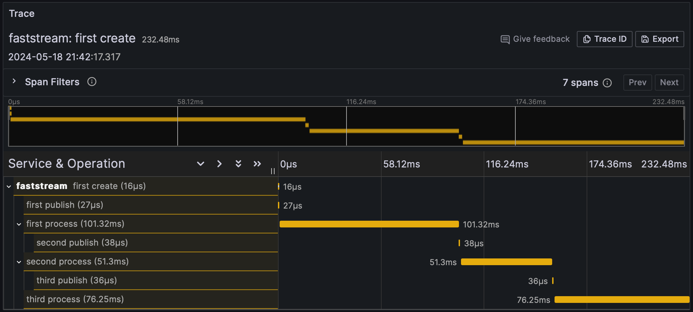
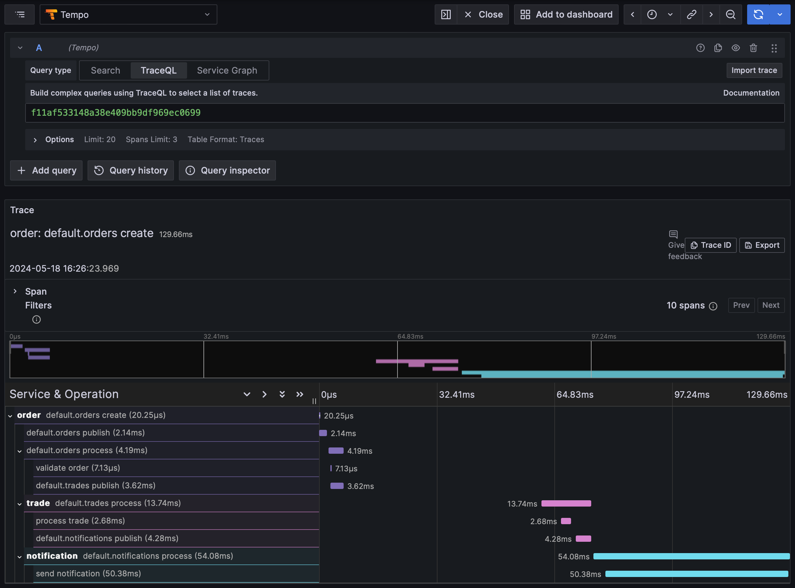

---
# 0.5 - API
# 2 - Release
# 3 - Contributing
# 5 - Template Page
# 10 - Default
search:
  boost: 10
---

# OpenTelemetry

**OpenTelemetry** is an open-source observability framework designed to provide a unified standard for collecting and exporting telemetry data such as traces, metrics, and logs. It aims to make observability a built-in feature of software development, simplifying the integration and standardization of telemetry data across various services. For more details, you can read the official [OpenTelemetry documentation](https://opentelemetry.io/){.external-link target="_blank"}.

## Tracing

Tracing is a form of observability that tracks the flow of requests as they move through various services in a distributed system. It provides insights into the interactions between services, highlighting performance bottlenecks and errors. The result of implementing tracing is a detailed map of the service interactions, often visualized as a trace diagram. This helps developers understand the behavior and performance of their applications. For an in-depth explanation, refer to the [OpenTelemetry tracing specification](https://opentelemetry.io/docs/concepts/signals/traces/){.external-link target="_blank"}.

{ .on-glb loading=lazy }
`Visualized via Grafana and Tempo`

This trace is derived from this relationship between handlers:

```python linenums="1"
@broker.subscriber("first")
@broker.publisher("second")
async def first_handler(msg: str):
    await asyncio.sleep(0.1)
    return msg


@broker.subscriber("second")
@broker.publisher("third")
async def second_handler(msg: str):
    await asyncio.sleep(0.05)
    return msg


@broker.subscriber("third")
async def third_handler(msg: str):
    await asyncio.sleep(0.075)
```

### FastStream Tracing

**OpenTelemetry** tracing support in **FastStream** adheres to the [semantic conventions for messaging systems](https://opentelemetry.io/docs/specs/semconv/messaging/){.external-link target="_blank"}.

To add a trace to your broker, you need to:

1. Install `FastStream` with `opentelemetry-sdk`

    ```shell
    pip install faststream[otel]
    ```

2. Configure `TracerProvider`

    ```python linenums="1" hl_lines="5-7"
    from opentelemetry import trace
    from opentelemetry.sdk.resources import Resource
    from opentelemetry.sdk.trace import TracerProvider

    resource = Resource.create(attributes={"service.name": "faststream"})
    tracer_provider = TracerProvider(resource=resource)
    trace.set_tracer_provider(tracer_provider)
    ```

3. Add `TelemetryMiddleware` to your broker

    {!> includes/getting_started/opentelemetry/1.md !}

### Exporting

To export traces, you must select and configure an exporter yourself:

* [opentelemetry-exporter-jaeger](https://pypi.org/project/opentelemetry-exporter-jaeger/){.external-link target="_blank"} to export to **Jaeger**
* [opentelemetry-exporter-otlp](https://pypi.org/project/opentelemetry-exporter-otlp/){.external-link target="_blank"} for export via **gRPC** or **HTTP**
* ``InMemorySpanExporter`` from ``opentelemetry.sdk.trace.export.in_memory_span_exporter`` for local tests

There are other exporters.

Configuring the export of traces via `opentelemetry-exporter-otlp`:

```python linenums="1" hl_lines="4-6"
from opentelemetry.exporter.otlp.proto.grpc.trace_exporter import OTLPSpanExporter
from opentelemetry.sdk.trace.export import BatchSpanProcessor

exporter = OTLPSpanExporter(endpoint="http://127.0.0.1:4317")
processor = BatchSpanProcessor(exporter)
tracer_provider.add_span_processor(processor)
```

### Visualization

To visualize traces, you can send them to a backend system that supports distributed tracing, such as **Jaeger**, **Zipkin**, or **Grafana Tempo**. These systems provide a user interface to visualize and analyze traces.

* **Jaeger**: You can run **Jaeger** using Docker and configure your **OpenTelemetry** middleware to send traces to **Jaeger**. For more details, see the [Jaeger documentation](https://www.jaegertracing.io/){.external-link target="_blank"}.
* **Zipkin**: Similar to **Jaeger**, you can run **Zipkin** using **Docker** and configure the **OpenTelemetry** middleware accordingly. For more details, see the [Zipkin documentation](https://zipkin.io/){.external-link target="_blank"}.
* **Grafana Tempo**: **Grafana Tempo** is a high-scale distributed tracing backend. You can configure **OpenTelemetry** to export traces to **Tempo**, which can then be visualized using **Grafana**. For more details, see the [Grafana Tempo documentation](https://grafana.com/docs/tempo/latest/){.external-link target="_blank"}.

### Context propagation

Quite often it is necessary to communicate with **other** services and to propagate the trace context, you can use the **CurrentSpan** object and follow the example:

```python linenums="1" hl_lines="5-7"
from opentelemetry import trace, propagate
from faststream.opentelemetry import CurrentSpan

@broker.subscriber("symbol")
async def handler(msg: str, span: CurrentSpan) -> None:
    headers = {}
    propagate.inject(headers, context=trace.set_span_in_context(span))
    price = await exchange_client.get_symbol_price(msg, headers=headers)
```

### Full example

To see how to set up, visualize, and configure tracing for **FastStream** services, go to [example](https://github.com/draincoder/faststream-monitoring){.external-link target="_blank"}.

An example includes:

* Three `FastStream` services
* Exporting traces to `Grafana Tempo` via `gRPC`
* Visualization of traces via `Grafana`
* Collecting metrics and exporting using `Prometheus`
* `Grafana dashboard` for metrics
* Examples with custom spans
* Configured `docker-compose` with the entire infrastructure

{ .on-glb loading=lazy }
`Visualized via Grafana and Tempo`

## Baggage

[OpenTelemetry Baggage](https://opentelemetry.io/docs/concepts/signals/baggage/){.external-link target="_blank"} is a context propagation mechanism that allows you to pass custom metadata or key-value pairs across service boundaries, providing additional context for distributed tracing and observability.

### FastStream Baggage

**FastStream** provides a convenient abstraction over baggage that allows you to:

* **Initialize** the baggage
* **Propagate** baggage through headers
* **Modify** the baggage
* **Stop** propagating baggage

### Example

To initialize the baggage and start distributing it, follow this example:

```python linenums="1" hl_lines="3-4"
from faststream.opentelemetry import Baggage

headers = Baggage({"hello": "world"}).to_headers({"header-type": "custom"})
await broker.publish("hello", "first", headers=headers)
```

All interaction with baggage at the **consumption level** occurs through the **CurrentBaggage** object, which is automatically substituted from the context:

```python linenums="1" hl_lines="6-10 17-18 24"
from faststream.opentelemetry import CurrentBaggage

@broker.subscriber("first")
@broker.publisher("second")
async def response_handler_first(msg: str, baggage: CurrentBaggage):
    print(baggage.get_all())  # {'hello': 'world'}
    baggage.remove("hello")
    baggage.set("user-id", 1)
    baggage.set("request-id", "UUID")
    print(baggage.get("user-id"))  # 1
    return msg


@broker.subscriber("second")
@broker.publisher("third")
async def response_handler_second(msg: str, baggage: CurrentBaggage):
    print(baggage.get_all())  # {'user-id': '1', 'request-id': 'UUID'}
    baggage.clear()
    return msg


@broker.subscriber("third")
async def response_handler_third(msg: str, baggage: CurrentBaggage):
    print(baggage.get_all())  # {}
```

!!! note
    If you consume messages in **batches**, then the baggage from each message will be merged into the **common baggage** available
    through the `get_all` method, but you can still get a list of all the baggage from the batch using the `get_all_batch` method.
